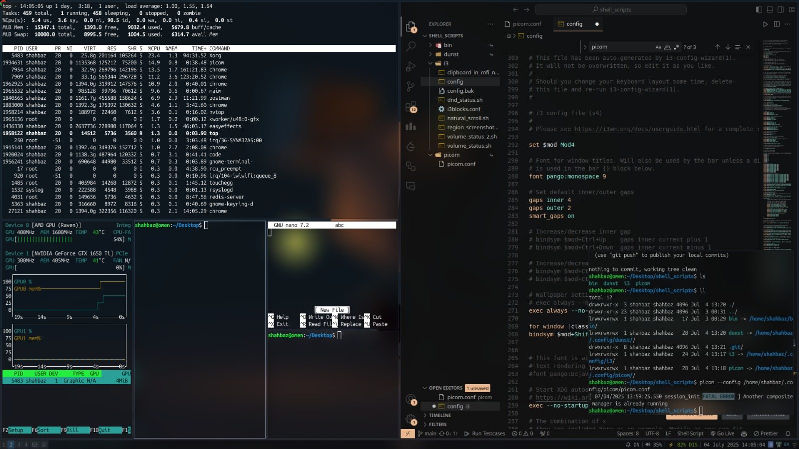

# Productive i3 WM Ubuntu Setup

This project automates the setup of a customized i3 window manager environment on Ubuntu 24.04 | Ubuntu 24.04 

## 📸 Screenshot



## ✨ Features

- ⚡ **Minimal & Productive**: Lightweight i3 window manager setup with essential tools preconfigured for fast and distraction-free productivity.
  
- 🪟 **Transparent, Glass-Like UI**: Beautiful visual effects using `picom` for transparency and blur.

- 📋 **Clipboard Manager**: Integrates copyq clipboard manager.

- 🪟 Supports both `rofi` and `dmenu` application launchers

- 🔔 **Notification System**: Clean glass like notification pop-ups via `dunst`.

- 🎧 **Bluetooth Manager**: Easily manage Bluetooth devices via `blueman`.

- 📁 **File Manager**: `thunar` is installed for graphical file browsing.

- 🎛️ **Base i3 Keybindings**: Includes essential i3 keybindings for launching apps, tiling windows, workspace switching, volume/brightness control, and more.

## ✅ Compatibility

This setup has been tested and confirmed working on:

- Ubuntu 24.04 LTS (Noble Numbat)
- Ubuntu 25.04 (Devel branch)

Other Debian-based distributions may work as well, but are not officially tested.

## 🛠️ How to Install

1. Clone the repository:
   ```bash
   git clone https://github.com/shahbaz42/productive-i3wm.git
   ````

2. Go to the project directory:

   ```bash
   cd productive-i3wm
   ```

3. Make the install script executable:

   ```bash
   chmod +x install.sh
   ```

4. Run the installer:

   ```bash
   ./install.sh
   ```

After installation, log out and select the **i3** session from your login screen to start using your custom i3 setup.

## ⌨️ Keybindings

Here are some essential keybindings from the i3 config. The mod key is set to <kbd>Mod4</kbd> (usually the **Super/Windows** key).

### 🔃 Window Management
| Keybinding                 | Action                               |
|---------------------------|--------------------------------------|
| <kbd>$mod</kbd> + <kbd>Enter</kbd> | Open terminal                      |
| <kbd>$mod</kbd> + <kbd>Alt</kbd> + <kbd>Return</kbd> | Open floating terminal 
| <kbd>$mod</kbd> + <kbd>Shift</kbd> + <kbd>Return</kbd> | Open Google Chrome (if installed) 
| <kbd>$mod</kbd> + <kbd>Shift</kbd> + <kbd>Q</kbd> | Close focused window              |
| <kbd>$mod</kbd> + <kbd>H/V</kbd>   | Split horizontally / vertically   |
| <kbd>$mod</kbd> + <kbd>F</kbd>     | Toggle fullscreen                 |
| <kbd>$mod</kbd> + <kbd>Space</kbd> | Launch Rofi app launcher          |
| <kbd>$mod</kbd> + <kbd>d</kbd> | Launch dmenu app launcher          |
| <kbd>$mod</kbd> + <kbd>Shift</kbd> + <kbd>Space</kbd> | Toggle floating mode             |
| <kbd>$mod</kbd> + <kbd>A</kbd>     | Focus parent container            |

### 🔁 Focus & Movement
| Keybinding                         | Action                             |
|-----------------------------------|------------------------------------|
| <kbd>$mod</kbd> + <kbd>J/K/L/;</kbd>     | Move focus left/down/up/right     |
| <kbd>$mod</kbd> + <kbd>Shift</kbd> + <kbd>J/K/L/;</kbd> | Move window left/down/up/right   |

### 🧱 Workspaces
| Keybinding                      | Action                          |
|--------------------------------|---------------------------------|
| <kbd>$mod</kbd> + <kbd>1–0</kbd>     | Switch to workspace 1–10       |
| <kbd>$mod</kbd> + <kbd>Shift</kbd> + <kbd>1–0</kbd> | Move window to workspace 1–10 |

### 🧰 Utilities
| Keybinding                        | Action                              |
|----------------------------------|-------------------------------------|
| <kbd>$mod</kbd> + <kbd>Shift</kbd> + <kbd>D</kbd> | Toggle DND mode using Dunst     |
| <kbd>$mod</kbd> + <kbd>Shift</kbd> + <kbd>V</kbd> | Open CopyQ clipboard manager    |
| <kbd>$mod</kbd> + <kbd>Shift</kbd> + <kbd>B</kbd> | Launch Blueman Bluetooth Manager |
| <kbd>$mod</kbd> + <kbd>Shift</kbd> + <kbd>N</kbd> | Set wallpaper using Nitrogen    |
| <kbd>Print</kbd>                 | Take a screenshot (region select)  |

### 🔊 Media & Volume
| Keybinding                | Action                            |
|--------------------------|-----------------------------------|
| <kbd>XF86AudioRaiseVolume</kbd> | Volume up                     |
| <kbd>XF86AudioLowerVolume</kbd> | Volume down                   |
| <kbd>XF86AudioMute</kbd>        | Mute/unmute audio             |
| <kbd>XF86AudioMicMute</kbd>     | Mute/unmute microphone        |
| <kbd>XF86AudioPlay/Pause</kbd>  | Media playback control        |
| <kbd>XF86MonBrightnessUp/Down</kbd> | Screen brightness control   |

### 🧪 Special Apps
| Keybinding                       | Action                        |
|---------------------------------|-------------------------------|
| <kbd>$mod</kbd> + <kbd>Shift</kbd> + <kbd>W</kbd> | Open WhatsApp in Chrome app mode (if pwa installed) |
| <kbd>$mod</kbd> + <kbd>Shift</kbd> + <kbd>M</kbd> | Open Thunderbird (if installed)                |
| <kbd>$mod</kbd> + <kbd>Shift</kbd> + <kbd>P</kbd> | Open Postman       (if installed)              |
| <kbd>$mod</kbd> + <kbd>Alt</kbd> + <kbd>Return</kbd> | Open floating terminal      
| <kbd>$mod</kbd> + <kbd>Shift</kbd> + <kbd>X</kbd> | Lock screen using i3lock         |

---

> For the full list, check the [`config`](./configs/i3/config) file inside this repo.

